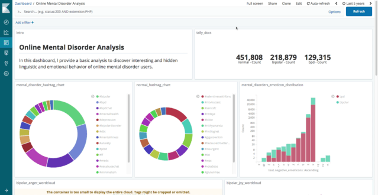

## Online Mental Disorder Analysis with Elasticsearch and Kibana
---
### Project Summary

In this presentation, I provide a basic analysis and feature engineering pipeline to discover interesting and hidden linguistic phenomena and emotional behaviors of online mental disorder users. The goals of the presentation are the following:

- To broadly show how to leverage Elasticsearch's ingest pipeline and custom analyzers for preprocessing and feature engineering
- To introduce common best practices for dealing with natural language data
- To discover insights that assist to improve feature engineering and ML models

### Prerequisites
To fully understand the material in this project, it assumes basic knowledge of Elasticsearch and Python. The Elastic [learning page](https://www.elastic.co/learn) and [official reference](https://www.elastic.co/guide/en/elasticsearch/reference/current/full-text-queries.html) are great places to start learning about Elasticsearch and Kibana.

### Requirements
Below are the requirements for this project:
- Install [Elasticsearch 6.6](https://www.elastic.co/downloads/elasticsearch)
- Install [Kibana 6.6](https://www.elastic.co/downloads/kibana)
- [Jupyter](https://jupyter.org/) (with Python 3.6)
- [Elasticsearch python module](https://elasticsearch-py.readthedocs.io/en/master/)

### Framework
In this project, I show how to insert the data discussed above into Elasticsearch to be able to conduct interesting featuring engineering and anlysis using Kibana and the developer tools. I make heavy use of the ingest pipeline to define processors through which the data will be fed before being indexed (stored) into Elasticsearch via the bulk API using `elasticsearch` [Python module](https://elasticsearch-py.readthedocs.io/en/master/). The code ([notebook](https://github.com/omarsar/clinical_nlp_elastic/blob/master/01-1-exporting-to-elastic.ipynb)) used to perform the bulk insert can be found in this repository.

### Data
The participants used in this analysis are collected from Twitter based on their self-reported status. The self-reported mental disorder cases were collected via a filter, "I am diagnosed with X". I only focus on bipolar disorder and borderline personality disorder self-reported cases. A seperate control group was randomly collected using the Twitter public API. All cases were manually verified and checked for data quality control. 

There are some ethical concerns about using the data so I didn't make it directly available. To obtain access to the dataset used in this presentation, please contact me directly at ellfae@gmail.com.

### Dashboard
The visualization dashboard built using Kibana looks as follows:

### Other Resources
The full presentation slides can be found [here](https://docs.google.com/presentation/d/1-FG3lpEptywAKFqQIH45cRDiZ0papB7V6BW7KPB37Ao/edit?usp=sharing)

